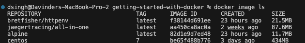

## Docker Images

- Images can be downloaded from `hub.docker.com`
- Anyone can upload their images to the official docker registery (hub.docker.com`)
- When running a container, it uses an isolated filesystem. This custom filesystem is provided by a container image. Since the image contains the container’s filesystem, it must contain everything needed to run an application - all dependencies, configurations, scripts, binaries, etc.
- The image also contains other configuration for the container, such as environment variables, a default command to run, and other metadata.
- We can push a docker image to the docker registry => docker push
- We can pull images from the docker registry => docker pull
- Docker registry is a place where all docker images are stored online, anyone can pull images from there.
- One image can have multiple containers

## Image layers

- Basically, a layer, or image layer is a change on an image, or an intermediate image. Every command you specify (FROM, RUN, COPY, etc.) in your Dockerfile causes the previous image to change, thus creating a new layer. You can think of it as staging changes when you're using git: You add a file's change, then another one, then another one...
- Consider the following Dockerfile:
  ```
  FROM rails:onbuild
  ENV RAILS_ENV production
  ENTRYPOINT ["bundle", "exec", "puma"]
  ```
- First, we choose a starting image: rails:onbuild, which in turn has many layers.
- We add another layer on top of our starting image, setting the environment variable RAILS_ENV with the ENV command. - Then, we tell docker to run bundle exec puma (which boots up the rails server). That's another layer.
- The concept of layers comes in handy at the time of building images. Because layers are intermediate images, if you make a change to your Dockerfile, docker will rebuild only the layer that was changed and the ones after that. This is called layer caching.
- Every image starts with a blank layer, known as scratch
- Every set of changes that happens after that on the file system in the image, is another layer.
- Every layer gets it's own SHA, that helps the system distinguish between layers.
- big advantage=> Not storing image data more than once in the file system.
- If we decide that same to be the base image for more layers, then its only ever storing one copy of each layer.
- Uploading and downloading will not the layers that have already been uploaded or downloaded.

## Image Tags and pushing to docker hub



- images do not have names, they have repository name and tags
- Only official images can have the single name as repo name, other images will have to be like this => username/repoName => davAppler/alpine
- `docker image tag SOURCE_IMAGE[:TAG] TARGET_IMAGE[:TAG]` => The `docker image tag` command is used to create a new tag or alias for an existing Docker image. By assigning a tag to an image, you can refer to the image using a more user-friendly or meaningful name, in addition to its original identifier or digest
- `SOURCE_IMAGE` refers to the name or ID of the source image you want to tag.
- `TARGET_IMAGE` is the name or ID of the new tagged image you want to create.
- TAG is an optional parameter that specifies the tag name for the image. If not provided, the default "latest" tag is used.
- `docker image tag myapp myapp:v1.0` => After running this command, you can refer to the same image using either the original name "myapp" or the new tag "myapp:v1.0".

- `docker image tag nginx davapplerr/nginx` => This creates a new image reference for `nginx`

## Building Images

- For reference go to => dockerfile-1/Dockerfile
- You can build your own images with the help of Docker files
- Dockerfile is like a recipe for the image building.
- The Docker file has a capital D
- Below is the content of the Dockerfile

```
FROM debian:bullseye-slim       // This is a layer

ENV NGINX_VERSION   1.23.4      // This is a layer
ENV NJS_VERSION     0.7.11      // This is a layer
ENV PKG_RELEASE     1~bullseye  // This is a layer

RUN apt-get update && apt-get install -y curl        // This is a layer

EXPOSE 80 443
```

- FROM

  - It should always have a FROM keyword, to tell which distribution you want to start with
  - If you truly want to start with an empty container, use FROM scratch

- ENV

  - ENV is for environment variables, it is a way to set their values.
  - They are the main way we et keys and values for container building and running container
  - One reason Env variables were choses as preferred way to inject key/value is they work everywhere, on every OS and Config.

- Orders of these statements matters

- RUN

  - The RUN instruction is used to execute commands during the build process of a Docker image. It allows you to run any command in the Docker container's filesystem, such as installing packages, configuring the environment, or executing scripts.
  - It runs the apt-get update and apt-get install commands to install the curl package.

- Expose

  - The EXPOSE instruction is used to inform Docker that the container will listen on specific network ports at runtime. It does not actually publish the ports or make them accessible from the host machine; rather, it serves as a form of documentation to indicate which ports are intended to be exposed when the container is running.

- Once you have written the layers in your docker file, you can go ahead and build an image from that docker file
- `docker image build -t myFirstImage .` => This will build an image from the dockerfile found in the present directory (That's what the dot . represents in the command)

- If we go ahead and change docker file and something new in a layer, let's say we change something in layer 5 and in total there 10 layers in the dockerfile.
- If we go and build a new image from the same docker file, it will not execute the layers 1 till 4 because their build already exists in the cache. It will just fetch them from the cache
- Since we made a change in layer 5, it will rebuild everything from layer 5 till layer 10.

TIP

- A good practice is to keep in mind the order of layers.
- Layers that change the most should be bottom most layers and layers that change the least should be top most layers in the Dockerfile


```
WOKRDIR /usr/share/nginx/html

COPY index.html index.html
```

- WORKRDIR : This is used to change the directory, this is the best way to do cd into a directory and not using the run command. (RUN cd somewhere/index.html)
- COPY : This will copy the content of our local index.html into nginx index.html, this is how copy command is used => `COPY <source> <destination>`


### Cleaning Images

- `docker image prune` => Will clean the dangling images
- `docker system prune` => Will clean up everything you're not currently using
- `docker image prune -a` => Will remove all images you're not using

