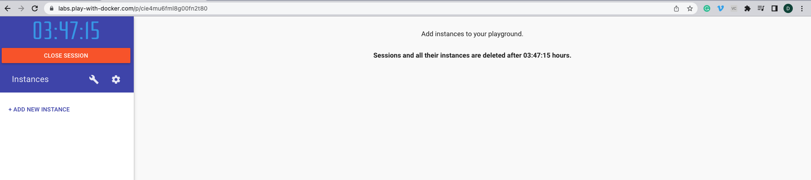
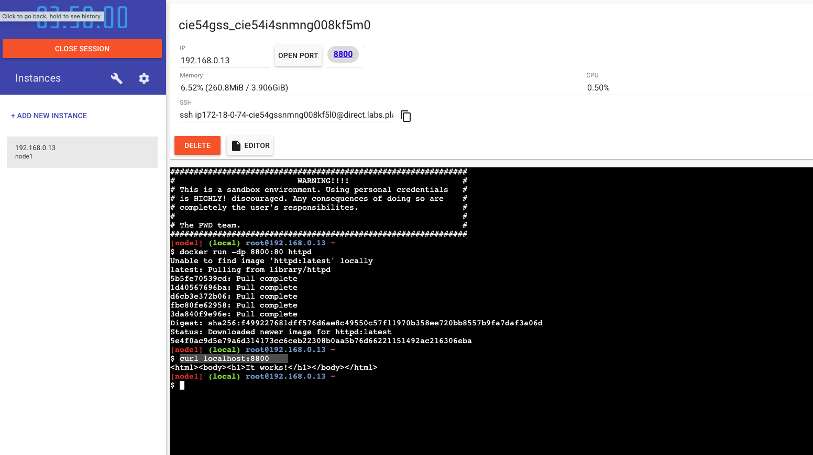

`This file contains the information related to https://labs.play-with-docker.com`

## Getting started

- Once you're logged into the website you should see this screen

- Then you can click on `ADD A NEW INSTANCE`, it will create an instance for you. Then you have a virtual
- Then you will see a terminal appearing on the screen
- Type this command to run an apache server on localhost:8800 => `docker run -dp 8800:80 httpd`
- httpd is the name of the image we want to run
- `-dp` => `-d` specifies that we want to run it in detached mode and `p` specifies the port binding, it tells their port 80 ( port `80` is default in the container where apache is running) to take this public port and forward the traffic to `localhost:8800`.
- `-p` says take
- We could also seperate `-dp` like this => `docker run -d -p 8800:80 httpd`
- Once you run the command it will download the layers of the images in the instance you have created.
- Next we can check if our localhost:8800 was working by running the command => `curl localhost:8800`
- This is what we get (refer to screenshot)

- We can run another apache server simultaneously on another port by specifying port other than 8800, and both of the containers will be independent.
- For example we can run => `docker run -dp 8801:80 httpd`
- Both of these two containers are running in two different process space, you ca check that by running `docker ps` command in the terminal.
