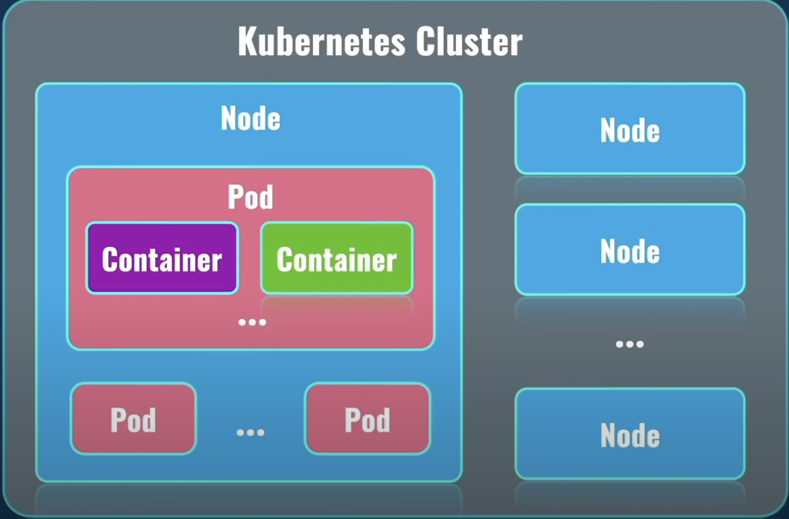
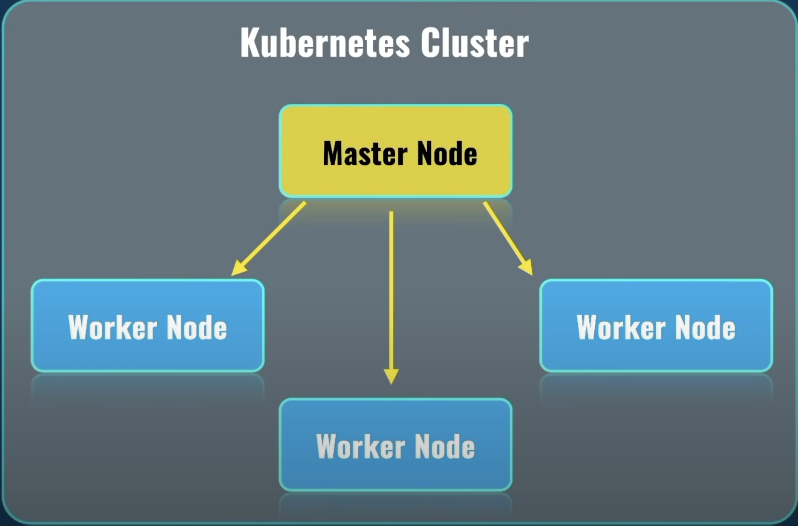

# Kubernetes

- Kubernetes, also known as K8s, is an open-source system for automating deployment, scaling, and management of containerized applications
- It is a container orchestrator
- Makes many serves acts like one
- Released by google but now maintained by open source community
- K8S takes care of automatic deployment of the containerized applications across different servers.
- Distribution of the load across multiple servers
- Auto scaling of the deployed applications
- Monitoring and health check of the containers
- Replacement of failed containers

## Pods

- Pod is the smallest unit in the K8S world like container in docker world
- Containers are created inside of the pod (1 or more)
- One container per pod is a common use case
- Each pod must be located on the same server
- Otherwise containers won't be able to talk to each other.
- Containers in pods share namespaces of the pod, like volumes or network IP address.
- Pods can be moved from one node to another without our intervention
- Pods can be deleted at any given time.

## Kubernetes Cluster

- It consists of node, node is a server.
- After configuration is done, K8S will deploy automatically pods on different nodes.



- in K8s we have a master node and worker node
- Master is responsible for distributing work load to worker nodes.
- Pods are deployed on worker nodes
- Master node runs only system pods, which are responsible for actual work of K8S cluster in general.
- Master node doesn't run client app



## Master and worker Nodes

- Different services run inside every node

  - kubelet: this service talks to master node via API server.
  - kube-proxy: Responsible for network communication inside of each node and between nodes
  - Container Runtime: Runs container inside of each node, for example Docker, containerD, CRIO.

- Different services run inside Master node
  - API Server : This service is responsible for talking to worker nodes via kubelet. This is the main point of communication.
  - Schedular: Planning and distribution of load between nodes in the cluster.
  - Kube controller manager: It is a single point which controls everything in the K8S cluster, it controls what happens in each of the node in the cluster.
  - Cloud Controller Manager: Job is to interact with cloud service provider where you run your K8S cluster.
  - etcd: Stores all logs related to operation of entire K8S cluster.


## Kubectl or KubeControl

- It is a CLI tool

## Minikube

- We can create cluster locally using minikube, with this we do not need to use any paid cloud provider like AWS or GCP or AZURE. Minikube runs a single-node Kubernetes cluster on your machine so that you can try out Kubernetes for your daily development work.
- Minikube is a tool that is primarily used to create a single-node Kubernetes cluster locally on your computer. It sets up a virtual machine (VM) running a single node, and within that node, it deploys a Kubernetes cluster for development and testing purposes.
- In a typical Minikube setup, the single node created by Minikube serves as both the master node and the worker node. This means that the node takes on the roles of both managing the Kubernetes control plane (master node responsibilities) and running container workloads (worker node responsibilities). It's a combined master/worker node for the sake of simplicity in a local development and testing environment.

## Running clusters with minikube and managing with kubectl

- minikube creates single node cluster.
- `minikube start --driver=docker` => starting minikube
- `minikube ssh` => When you run `minikube ssh`, it connects to the Minikube VM, giving you direct access to the VM's command line. This can be useful for debugging, inspecting the VM, and performing various tasks that require shell access to the Minikube node.
- `kubectl` => type this command to see a list of available commands for `kubectl`
- `kubectl cluster-info` => Will display the information of the cluster
- `kubectl get nodes` => will give the list of nodes
- `kubectl get namespaces` => namespaces are used here to group the different resources and configuration object.
- `kubectl get pods --namespace=kube-system` => will list the pods from that namespace
- `kubectl run nginx --image=nginx` => is creating a new deployment named "nginx" using the official Nginx container image.
- `kubectl describe pod nginx`

```
@getting-started-with-docker % minikube ssh
docker@minikube:~$ docker ps | grep nginx
7323e7111a36   nginx                       "/docker-entrypoint.…"   7 minutes ago    Up 7 minutes              k8s_nginx_nginx_default_702275c4-4070-4435-ad72-b1962f3f1ac7_0
616c5d912f24   registry.k8s.io/pause:3.9   "/pause"                 7 minutes ago    Up 7 minutes              k8s_POD_nginx_default_702275c4-4070-4435-ad72-b1962f3f1ac7_0
```

- You can see the pause container above, it is used to keep the namespace because the container itself can be removed, restarted or deleted, in order to preserve the namespace, we have the pause container
- `kubectl delete pod nginx` => will delete the pod.
