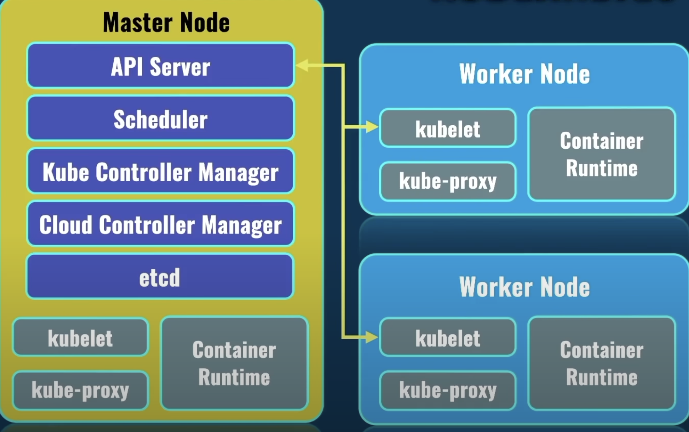

# Kubernetes

- Kubernetes, also known as K8s, is an open-source system for automating deployment, scaling, and management of containerized applications
- It is a container orchestrator
- Makes many serves acts like one
- Released by google but now maintained by open source community
- K8S takes care of automatic deployment of the containerized applications across different servers.
- Distribution of the load across multiple servers
- Auto scaling of the deployed applications
- Monitoring and health check of the containers
- Replacement of failed containers

## Pods

- Pod is the smallest unit in the K8S world like container in docker world
- Containers are created inside of the pod (1 or more)
- One container per pod is a common use case
- Each pod must be located on the same server
- Otherwise containers won't be able to talk to each other.
- Containers in pods share namespaces of the pod, like volumes or network IP address.
- Pods can be moved from one node to another without our intervention
- Pods can be deleted at any given time.

## Kubernetes Cluster

- It consists of node, node is a server.
- After configuration is done, K8S will deploy automatically pods on different nodes.

- in K8s we have a master node and worker node
- Master is responsible for distributing work load to worker nodes.
- Pods are deployed on worker nodes
- Master node runs only system pods, which are responsible for actual work of K8S cluster in general.
- Master node doesn't run client app

## Master and worker Nodes

- Different services run inside every node

  - kubelet: this service talks to master node via API server.
  - kube-proxy: Responsible for network communication inside of each node and between nodes
  - Container Runtime: Runs container inside of each node, for example Docker, containerD, CRIO.

- Different services run inside Master node
  - API Server : This service is responsible for talking to worker nodes via kubelet. This is the main point of communication.
  - Schedular: Planning and distribution of load between nodes in the cluster.
  - Kube controller manager: It is a single point which controls everything in the K8S cluster, it controls what happens in each of the node in the cluster.
  - Cloud Controller Manager: Job is to interact with cloud service provider where you run your K8S cluster.
  - etcd: Stores all logs related to operation of entire K8S cluster.

## Kubectl or KubeControl

- It is a CLI tool
-
